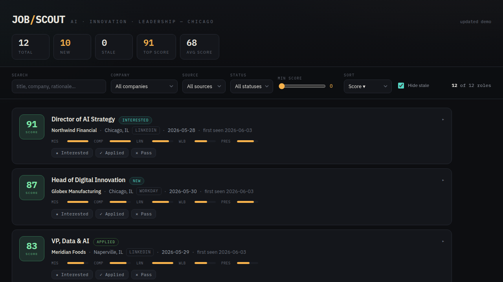

# job-scout

A config-driven job **discovery, scoring, and self-tuning** engine. It scrapes
public job listings from multiple sources, cross-references them against *your*
resume, scores fit against *your* weighted criteria with an LLM, and writes a
ranked, deduplicated tracker — a local **CSV + a filterable HTML dashboard** (or
Google Sheets) — on a schedule and on demand. Over time it **learns what's
working and re-tunes its own search**.



> **It is discovery + scoring + a tracker. It is *not* an auto-applier.**
> job-scout never logs into a site, fills a form, or submits an application. It
> finds relevant roles, ranks them by your priorities, and hands you a clean
> tracker. A human makes every apply decision. See [Ethics & ToS](#ethics--tos).

There is **no personal data in this repo.** Everything user-specific lives in
git-ignored config, resume, and output files; the repo ships only `*.example`
templates.

---

## How it works

One pipeline. The scheduled cron and on-demand runs both call the same
`run_pipeline(config)` — no duplicated logic.

```
 sources ─► normalize ─► dedupe ─► enrich ─► score ─► sinks ─► ledger
   │                                  │         │        │
   ├─ jobspy boards (Indeed,          │         │        ├─ CSV  (output/jobs.csv)
   │   LinkedIn)                       │         │        ├─ HTML (output/jobs.html)
   └─ ats/* (Greenhouse, Lever,        │         │        └─ (or Google Sheets)
       Ashby, SmartRecruiters,          │         │
       Workday)                          │         └─ hard filters → LLM rubric scoring
                                          └─ LinkedIn JD enrichment (top-N, cached)
```

**Pipeline stages:**

1. **sources** — each source returns raw job dicts. [JobSpy](https://github.com/cullenwatson/JobSpy)
   pulls public boards (Indeed + LinkedIn); one module per ATS pulls official
   public JSON (Greenhouse, Lever, Ashby, SmartRecruiters, Workday). Each source
   is wrapped so one dead source can't kill the run. *(Google Jobs is intentionally
   omitted — JobSpy's parser reliably returns nothing.)*
2. **normalize** — every source is mapped into one `Job` schema.
3. **dedupe** — composite-key exact match (`title + company + location`,
   normalized) plus a fuzzy `rapidfuzz` pass, across sources *and* across runs.
   Prefers the direct ATS/apply URL over the aggregator link.
4. **enrich** — LinkedIn only returns a description via a per-job request, so we
   fetch full JDs for just the top-N most resume-relevant LinkedIn roles (ranked
   by a local embedding), via the public guest endpoint, **cached forever** and
   paced — rich scoring without proxies or rate-limit bans.
5. **score** — cheap deterministic hard filters (remote policy, excluded
   industries/keywords, **excluded companies**, **excluded title keywords**,
   seniority gate), an optional embedding pre-filter, then concurrent LLM rubric
   scoring on the survivors. Ranked by overall score.
6. **sinks** — upserts the ranked tracker into the CSV (and regenerates the HTML
   dashboard), or Google Sheets. Upsert is by apply-URL, so re-runs never
   duplicate rows; vanished listings are marked `stale`; your manual statuses are
   preserved. Also writes `state/` (seen hashes + snapshot).
7. **ledger** — records per-keyword and per-company yield (roles found,
   high-scorers, avg/max score, your interest hits) to `state/discovery.json` —
   the memory the [strategist](#adaptive-discovery) learns from.

### The dashboard

Every run regenerates `output/jobs.html` — a single self-contained file (data
embedded inline, no server needed). Open it in a browser to filter by search,
company, source, status, and min-score; sort; and expand any card for the LLM's
rationale and red flags.

To **persist interest decisions**, run the tiny localhost helper and use its URL:

```bash
python scripts/serve.py            # http://127.0.0.1:8765/
```

Then the ★ Interested / ✓ Applied / ✕ Pass buttons write straight back to the
CSV (and survive the next run). Opened as a bare `file://`, the buttons fall back
to `localStorage`. Regenerate the dashboard any time with `python scripts/report.py`.

### Adaptive discovery

The search isn't static. A **strategist** (run on its own cadence) reads the
ledger, your recent high-scoring roles, your interest signals, and your resume,
then proposes new keywords and companies — under a hard guardrail: **every
addition needs a resume-tied reason and a relevance score ≥ 0.7**; adjacent bends
are allowed only with strong justification.

```bash
python scripts/strategist.py --dry-run   # propose only, change nothing
python scripts/strategist.py             # propose + auto-apply keyword changes
```

Its additions go in a separate, machine-managed `config/discovery_additions.yaml`
that `load_config` merges at load time — **your hand-curated config is never
rewritten**, and you can reset the loop's additions by deleting that one file.
(Company additions need an ATS lookup, so they're applied by the scheduled
strategist job, which resolves slugs before adding.)

### Configuration model

All personalization lives in `config/` and `resume/`. Ship only the `.example`
files; copy them to the real (git-ignored) names and edit.

| File | Purpose |
|------|---------|
| [`config/search.yaml`](config/search.example.yaml) | What/where to search: `keywords`, `location`, `seniority`, `freshness_hours`, `results_per_board`, and `hard_filters` — excluded industries/keywords, include keywords, **`exclude_companies`** (drop by employer), **`exclude_title_keywords`** (drop by role type, e.g. sales). |
| [`config/companies.yaml`](config/companies.example.yaml) | Target employers for direct-ATS pulls: `name`, `ats`, slug/tenant fields. See [docs/finding-ats-slugs.md](docs/finding-ats-slugs.md). |
| [`config/scoring.yaml`](config/scoring.example.yaml) | Rubric `dimensions` (`id`, `weight`, `prompt`), `scale`, `role_fit_gate`, the scoring `model`, the embedding `pre_filter`. |
| [`config/sources.yaml`](config/sources.example.yaml) | Sources on/off: `boards` (JobSpy `sites`, `proxies`, `linkedin_fetch_description`, `linkedin_enrich_max`) and `ats`. |
| `config/discovery_additions.yaml` | **Machine-managed** by the strategist (keywords/companies/excludes it added). Not committed; safe to delete to reset. |
| [`resume/resume.md`](resume/resume.example.md) | Plain-markdown resume the scorer compares each listing against. Git-ignored. |

---

## Quickstart

The default CSV + dashboard sink needs **no cloud account** — just a resume and an
LLM key.

```bash
git clone https://github.com/OWNER/REPO.git job-scout
cd job-scout
python -m venv .venv && . .venv/bin/activate
pip install -r requirements.txt
```

1. **Copy the templates** (the real names are git-ignored):

   ```bash
   for f in search companies scoring sources; do cp config/$f.example.yaml config/$f.yaml; done
   cp resume/resume.example.md resume/resume.md   # then paste your real resume
   ```

2. **Edit** `config/search.yaml` (keywords, location, filters) and
   `config/companies.yaml` (target employers — see
   [docs/finding-ats-slugs.md](docs/finding-ats-slugs.md)).

3. **Add secrets** — copy `.env.example` → `.env` and set:

   | Var | Required | What it is |
   |-----|----------|------------|
   | `ANTHROPIC_API_KEY` | for scoring | LLM rubric scoring. Works with any Anthropic-compatible endpoint. |
   | `ANTHROPIC_BASE_URL` | optional | Point scoring at a compatible endpoint (e.g. an OpenAI-of-record / MiniMax Anthropic API) — the SDK honors it. |
   | `JOB_SCOUT_SINK` | optional | `csv` (default) or `google_sheets`. |
   | `JOBS_CSV_PATH` | optional | CSV output path (default `output/jobs.csv`). |
   | `GOOGLE_SERVICE_ACCOUNT_JSON`, `SHEET_ID` | Sheets only | If using the Google Sheets sink — see [docs/sheets-setup.md](docs/sheets-setup.md). |
   | `PROXY_URLS` | optional | Comma-separated proxies for board scraping. |

   *(Scoring degrades gracefully: with no key it still gathers, dedupes, and
   tracks — just unscored.)*

4. **Run it:**

   ```bash
   python scripts/run.py --config config/search.yaml
   ```

   Open `output/jobs.html` — a ranked, deduped, filterable dashboard. (Or your
   Google Sheet if you chose that sink — run `python scripts/setup_sheet.py` once first.)

5. **Schedule it** (see below) and, optionally, **start the interest server**
   (`python scripts/serve.py`).

---

## Scheduling

The default CSV sink runs anywhere — any scheduler works (cron, systemd timer,
or the included GitHub Actions workflows). Two jobs:

- **Discovery** (e.g. daily): `python scripts/run.py --config config/search.yaml`
- **Strategist** (e.g. every few days): `python scripts/strategist.py --config config/search.yaml`

`.github/workflows/daily.yml` runs discovery on a schedule and on
`workflow_dispatch`; `on_demand.yml` is a dispatch-only twin for a separate run
history. (Those commit `state/` back to the repo for cross-run memory in CI; for
a local schedule the on-disk `state/` persists on its own and need not be
committed.)

### Caveats

- **Scheduled runs can be delayed** under load — don't treat the time as exact.
- **Keep volume low, cadence daily** — small result counts, fresh-only windows.
  Respectful scraping is ban-resistant scraping.

---

## Scripts

| Script | What it does |
|--------|--------------|
| `scripts/run.py` | The pipeline (gather → score → write tracker + dashboard + ledger). |
| `scripts/report.py` | Regenerate `output/jobs.html` from the CSV on demand. |
| `scripts/serve.py` | Localhost server so the dashboard's interest buttons persist to the CSV. |
| `scripts/strategist.py` | Digest the ledger + resume → propose & apply guarded search changes. |
| `scripts/setup_sheet.py` | One-time Google Sheet header init (Sheets sink only). |

Run tests with `pytest`.

---

## Ethics & ToS

job-scout is built to be ToS-defensible, ban-resistant, and respectful.

- **Public-data only.** It reads publicly visible listings and public ATS JSON
  endpoints. It does **not** log in, solve CAPTCHAs, or bypass authentication.
- **No auto-apply.** It stops at discovery + scoring. A human applies, every time.
- **Respect ToS and robots.** Some boards prohibit scraping in their terms; using
  the board scrapers is **at your own risk**. Direct ATS JSON endpoints are the
  recommended, lowest-risk path — prefer them.
- **LinkedIn, carefully.** The LinkedIn source and JD enrichment read only
  public, unauthenticated endpoints, fetch descriptions for a small top-N, cache
  them, and pace requests — to stay low-volume and respectful. Never point this at
  a logged-in session; account bans are real. Scraping is against LinkedIn's ToS —
  use at your own risk and keep volume low.
- **No warranty.** Scrapers break, endpoints change, LLM scores are imperfect.
  Treat the tracker as a ranked shortlist, not a verdict — verify before you act.

---

## License

MIT — see [LICENSE](LICENSE). Dependencies carry their own licenses, notably
[JobSpy](https://github.com/cullenwatson/JobSpy) (MIT) and
[sentence-transformers](https://github.com/UKPLab/sentence-transformers) (Apache-2.0).

See [PROJECT.md](PROJECT.md) for the architecture spec and
[docs/adaptive-discovery-plan.md](docs/adaptive-discovery-plan.md) for the
feedback-loop design.
