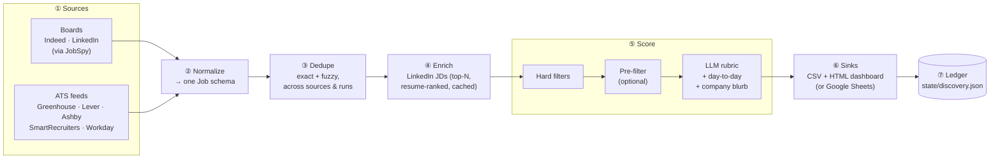
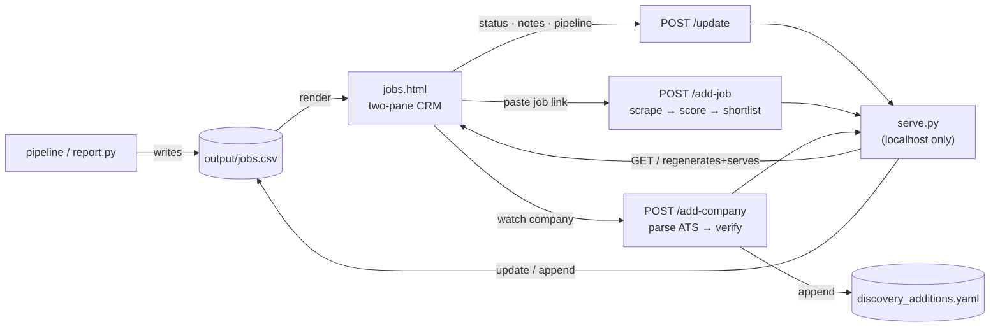
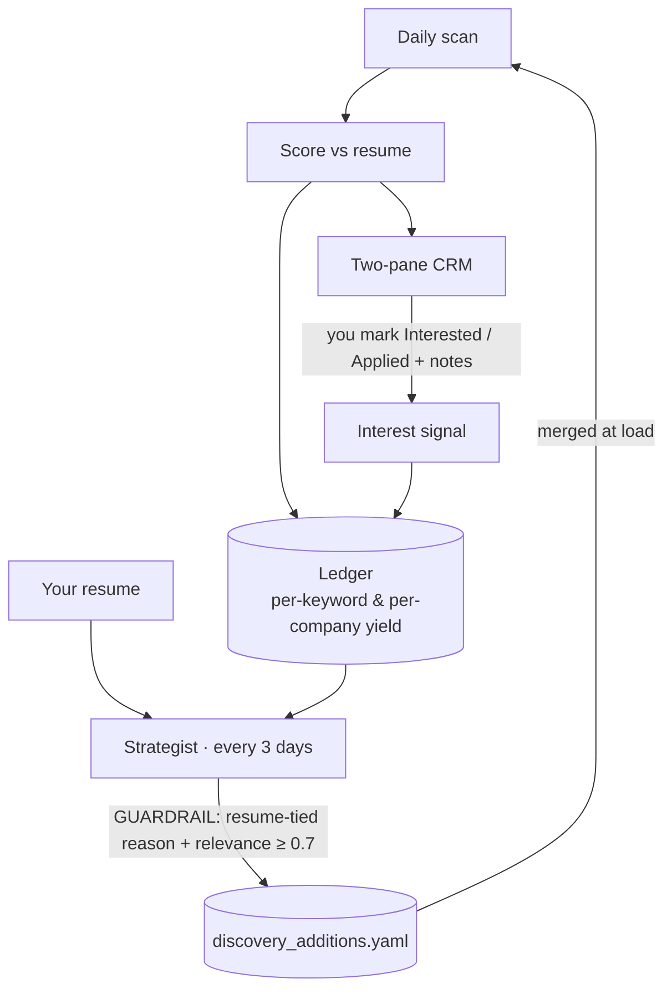

# job-scout

A config-driven job **discovery, scoring, and self-tuning** engine. It pulls
public job listings from multiple sources, cross-references each against *your*
resume, scores fit against *your* weighted criteria with an LLM, distills the
day-to-day responsibilities + a company blurb, and writes a ranked, deduplicated
tracker — a local **two-pane CRM dashboard** (CSV-backed) or Google Sheets — on a
schedule and on demand. Over time it **learns from what you engage with and
re-tunes its own search**.

https://github.com/user-attachments/assets/55ef7307-aa1b-4ee8-b252-b66b64684be0

> **It is discovery + scoring + a tracker. It is *not* an auto-applier.**
> job-scout never logs in, fills a form, or submits an application. It finds
> relevant roles, ranks them by your priorities, and hands you a clean board to
> work. A human makes every apply decision. See [Ethics & ToS](#ethics--tos).

There is **no personal data in this repo.** Everything user-specific lives in
git-ignored config, resume, and output files; the repo ships only `*.example`
templates.

---

## At a glance

- **Multi-source discovery** — Indeed + LinkedIn boards, plus direct pulls from
  any company's official ATS feed (Greenhouse, Lever, Ashby, SmartRecruiters, Workday).
- **LLM fit-scoring vs your resume** — a weighted rubric (your dimensions), plus
  distilled **day-to-day responsibilities** and a **company blurb** per role.
- **A two-pane CRM dashboard** — pipeline (Interested → Applied → Interview →
  Offer), notes, filters, and **add-from-link** (paste a job URL to scrape+score
  it, or a careers URL to watch a company).
- **A feedback loop** — a *strategist* studies what scores well and what you mark
  interested, then proposes new keywords/companies under a resume-fit guardrail.
- **Local-first & private** — default sink is a local CSV + self-contained HTML.
  No cloud account required. Your data never leaves the machine.

---

## Architecture

One pipeline. Scheduled and on-demand runs both call the same
`run_pipeline(config)` — no duplicated logic.



1. **Sources** — each returns raw job dicts. [JobSpy](https://github.com/cullenwatson/JobSpy)
   pulls public boards; one module per ATS pulls official public JSON. Each source
   is isolated so one dead source can't kill the run. *(Google Jobs is omitted —
   JobSpy's parser reliably returns nothing.)*
2. **Normalize** — every source maps into one `Job` schema.
3. **Dedupe** — composite-key exact match (`title + company + location`, normalized)
   plus a fuzzy `rapidfuzz` pass, across sources **and** across runs. Prefers the
   direct ATS/apply URL over the aggregator link.
4. **Enrich** — LinkedIn only returns a description via a per-job request, so we
   fetch full JDs for just the top-N most resume-relevant LinkedIn roles (ranked by
   a local embedding), via the public guest endpoint, **cached forever** and paced.
5. **Score** — a funnel (see [Scoring methodology](#scoring-methodology)).
6. **Sinks** — upserts the tracker by apply-URL (re-runs never duplicate; vanished
   listings → `stale`; your statuses/notes preserved), and regenerates the dashboard.
7. **Ledger** — records per-keyword & per-company yield (roles, high-scorers,
   avg/max score, your interest hits) — the memory the strategist learns from.

---

## Data resources

| Resource | Where | What it holds |
|---|---|---|
| **Job boards** | Indeed, LinkedIn (via JobSpy) | Title, company, location, URL, posting date, description (Indeed) |
| **ATS feeds** | Greenhouse / Lever / Ashby / SmartRecruiters / Workday public JSON | The company's own open roles, straight from the source (the lowest-risk path) |
| **LinkedIn guest endpoint** | `…/jobs-guest/jobs/api/jobPosting/{id}` | Full JD for the top-N enriched roles (no auth, cached) |
| **Your resume** | `resume/resume.md` (git-ignored) | The text every role is scored against |
| **Tracker** | `output/jobs.csv` (git-ignored) | One row per role — the canonical store the dashboard renders |
| **Dashboard** | `output/jobs.html` (regenerated each run) | Self-contained two-pane CRM |
| **Discovery ledger** | `state/discovery.json` (git-ignored) | Per-keyword/company performance over time |
| **Strategist additions** | `config/discovery_additions.yaml` | Machine-managed keywords/companies/excludes (merged at load) |
| **Seen-state** | `state/seen_hashes.json`, `snapshot.sqlite` | Cross-run dedup memory |

**Tracker schema** (`SHEET_COLUMNS`): `score`, the five dimension scores
(`mission`, `comp`, `learning`, `wlb`, `prestige`), `title`, `company`,
`location`, `comp_estimate`, `source`, `date_posted`, `first_seen`, `apply_url`,
`status`, `rationale`, `red_flags`, **`day_to_day`**, **`company_blurb`**,
**`notes`**, **`applied_on`**. The last four are owned by you and the LLM and are
preserved across every run.

---

## Scoring methodology

Scoring is a **cheap-to-expensive funnel** — deterministic gates first, the LLM
only on what survives (so we never pay to score a role that's obviously wrong):

1. **Hard filters** (free, deterministic) — remote policy; excluded industries
   and keywords; **`exclude_companies`** (by employer); **`exclude_title_keywords`**
   (by role type, e.g. sales); and a loose **seniority gate**.
2. **Pre-filter** (optional) — a local `sentence-transformers` embedding cuts
   obviously-irrelevant roles before paying for the LLM. Off by default.
3. **LLM rubric** — each survivor is scored on **your** weighted dimensions, using
   **only** the resume + listing. One call per role, run **concurrently**. The same
   call returns:
   - per-dimension integer scores → a weighted **overall score (0–100)**,
   - a **rationale** citing JD evidence,
   - **red flags** (comp/location/seniority mismatches),
   - a **comp estimate**,
   - the **day-to-day** (3–6 distilled, verb-led responsibility bullets),
   - a **company blurb** (1–2 sentences — the one field allowed to use general
     knowledge of the company).

The rubric lives entirely in `config/scoring.yaml` — dimensions, weights, scale,
and the model. Nothing about *what fits* is baked into code. Manually-added roles
(pasted links) skip the hard filters — you added them on purpose — and are scored
the same way.

---

## The dashboard (CRM)

`output/jobs.html` is a single self-contained file — open it straight from disk
for a **read-only** view. Run the tiny localhost server to turn it into a **live
app** that persists everything:

```bash
python scripts/serve.py            # http://127.0.0.1:8765/
```



- **Left pane** — a command bar (paste a job link or a careers URL), a segmented
  **pipeline filter** with live counts, search + company/source/sort, and a role
  list with heat-mapped score chips.
- **Right pane** — full detail: company blurb, the **pipeline control**
  (Interested → Applied → Interview → Offer, + Pass/Archive; marking *Applied*
  auto-stamps the date), per-dimension fit bars, **day-to-day** bullets, an
  **autosaving notes** box, and (collapsed) the rationale + red flags.
- **Progressive enhancement** — served = full app; opened as a `file://` =
  read-only viewer with a `localStorage` fallback. Stdlib-only, loopback-only.

Regenerate the static file any time with `python scripts/report.py`.

---

## Adaptive discovery (the feedback loop)

The search isn't static. It learns from two signals — **what scores well** and
**what you engage with** — and re-tunes itself.



The **strategist** digests the ledger, your recent high-scorers, your interest
hits, and your resume, then proposes new keywords and companies — under a hard
guardrail: **every addition needs a resume-tied reason and a relevance ≥ 0.7**;
adjacent bends only with strong justification. It also resolves a proposed
company's ATS before adding it.

```bash
python scripts/strategist.py --dry-run   # propose only, change nothing
python scripts/strategist.py             # propose + auto-apply keyword changes
```

Additions land in the separate, machine-managed `config/discovery_additions.yaml`
that `load_config` merges at load time — **your hand-curated config is never
rewritten**, and deleting that one file resets every machine-added item.

---

## Configuration model

All personalization lives in `config/` and `resume/`. Ship only the `.example`
files; copy them to the real (git-ignored) names and edit.

| File | Purpose |
|------|---------|
| [`config/search.yaml`](config/search.example.yaml) | What/where: `keywords`, `location`, `seniority`, `freshness_hours`, `results_per_board`, and `hard_filters` — excluded industries/keywords, include keywords, **`exclude_companies`**, **`exclude_title_keywords`**. |
| [`config/companies.yaml`](config/companies.example.yaml) | Watch-list employers for direct-ATS pulls. See [docs/finding-ats-slugs.md](docs/finding-ats-slugs.md). |
| [`config/scoring.yaml`](config/scoring.example.yaml) | Rubric `dimensions` (`id`, `weight`, `prompt`), `scale`, `role_fit_gate`, the `model`, the embedding `pre_filter`. |
| [`config/sources.yaml`](config/sources.example.yaml) | Sources on/off: `boards` (`sites`, `proxies`, `linkedin_fetch_description`, `linkedin_enrich_max`) and `ats`. |
| `config/discovery_additions.yaml` | **Machine-managed** by the strategist. Not committed; safe to delete to reset. |
| [`resume/resume.md`](resume/resume.example.md) | Plain-markdown resume the scorer compares each listing against. |

---

## Quickstart

The default CSV + dashboard sink needs **no cloud account** — just a resume and an
LLM key.

```bash
git clone https://github.com/Treibs/job-scout.git job-scout
cd job-scout
python -m venv .venv && . .venv/bin/activate
pip install -r requirements.txt

# copy templates (real names are git-ignored), then edit them + paste your resume
for f in search companies scoring sources; do cp config/$f.example.yaml config/$f.yaml; done
cp resume/resume.example.md resume/resume.md
cp .env.example .env            # set ANTHROPIC_API_KEY (and ANTHROPIC_BASE_URL if using a compatible endpoint)

python scripts/run.py --config config/search.yaml   # scan + score + write the tracker
python scripts/serve.py                              # open http://127.0.0.1:8765/
```

**Secrets** (`.env`): `ANTHROPIC_API_KEY` (scoring; works with any
Anthropic-compatible endpoint via `ANTHROPIC_BASE_URL`), optional
`JOB_SCOUT_SINK` (`csv`|`google_sheets`), `JOBS_CSV_PATH`, `PROXY_URLS`, and
`GOOGLE_SERVICE_ACCOUNT_JSON`/`SHEET_ID` for the Sheets sink. *Scoring degrades
gracefully — with no key it still gathers, dedupes, and tracks, just unscored.*

---

## Scheduling

The default CSV sink runs anywhere — cron, systemd timer, or the included GitHub
Actions workflows. Two jobs:

- **Discovery** (e.g. daily): `python scripts/run.py --config config/search.yaml`
- **Strategist** (e.g. every 3 days): `python scripts/strategist.py --config config/search.yaml`

Keep volume low and cadence daily — small result counts and fresh-only windows.
Respectful scraping is ban-resistant scraping.

---

## Scripts

| Script | What it does |
|--------|--------------|
| `scripts/run.py` | The pipeline (gather → score → write tracker + dashboard + ledger). |
| `scripts/serve.py` | Localhost CRM server — persist status/notes, scrape a job link, watch a company. |
| `scripts/report.py` | Regenerate `output/jobs.html` from the CSV on demand. |
| `scripts/strategist.py` | Digest the ledger + resume → propose & apply guarded search changes. |
| `scripts/setup_sheet.py` | One-time Google Sheet header init (Sheets sink only). |

Run tests with `pytest`.

---

## Ethics & ToS

Built to be ToS-defensible, ban-resistant, and respectful.

- **Public-data only.** Publicly visible listings and public ATS JSON endpoints.
  No login, no CAPTCHA-solving, no auth bypass.
- **No auto-apply.** Stops at discovery + scoring. A human applies, every time.
- **Respect ToS and robots.** Some boards prohibit scraping; the board scrapers
  are **at your own risk**. Direct ATS JSON endpoints are the recommended path.
- **LinkedIn, carefully.** The LinkedIn source + JD enrichment read only public,
  unauthenticated endpoints, fetch a small top-N, cache them, and pace requests.
  Never point this at a logged-in session. Scraping is against LinkedIn's ToS —
  use at your own risk and keep volume low.
- **No warranty.** Scrapers break, endpoints change, LLM scores are imperfect.
  Treat the tracker as a ranked shortlist, not a verdict — verify before you act.

---

## License

MIT — see [LICENSE](LICENSE). Dependencies carry their own licenses, notably
[JobSpy](https://github.com/cullenwatson/JobSpy) (MIT) and
[sentence-transformers](https://github.com/UKPLab/sentence-transformers) (Apache-2.0).

See [PROJECT.md](PROJECT.md) for the architecture spec and
[docs/adaptive-discovery-plan.md](docs/adaptive-discovery-plan.md) for the
feedback-loop design.
